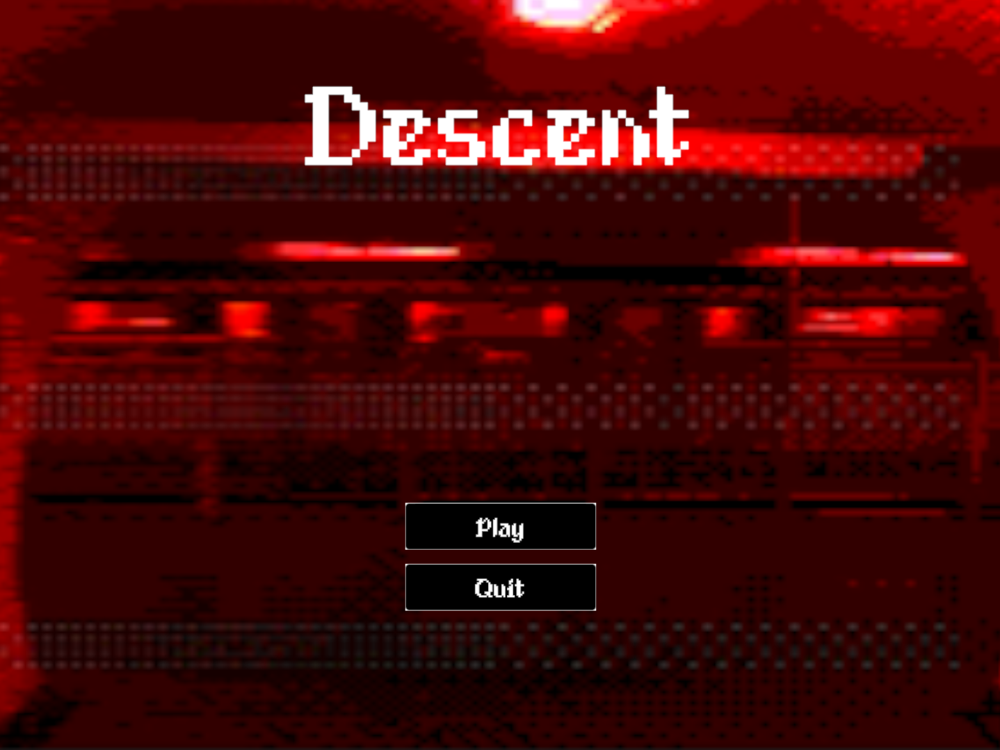

Moteur : Unity 
Equipe : 4 personnes 
Mon rôle : Programmation, game design, scénario et dialogues 

<table>
  <tr>
    <td> </td>
    <td> </td>
  </tr>
  <tr>
    <td> </td>
    <td> </td>
  </tr>
</table>

## Processus créatif

#### Moodboard
<table>
  <tr>
    <td> </td>
    <td> </td>
  </tr>
  <tr>
    <td> </td>
    <td> </td>
  </tr>
</table>

#### Design & narrative breakdown

<table>
  <tr>
    <td> </td>
    <td> </td>
  </tr>
</table>

#### Storyboards

<table>
  <tr>
    <td> </td>
    <td> </td>
  </tr>
  <tr>
    <td> </td>
  </tr>
</table>

#### Détails des interactions

<table>
  <tr>
    <td> </td>
    <td> </td>
  </tr>
</table>

#### Ecriture des dialogues

